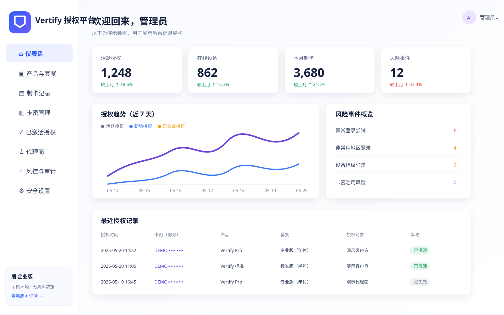

# Lumistar — 卡密验证与软件许可平台

面向 Windows C++ 游戏辅助客户端的企业级卡密（License Key）验证系统：

- **卡密全生命周期**：批次制卡、首次激活、续费、冻结、吊销、作废
- **机器码绑定**：多因子设备指纹 + TPM/CNG 非导出设备密钥，加权匹配、换机与解绑管控
- **心跳租约**：短期签名租约、在线宽限、并发设备数原子控制、秒级吊销传播
- **Web 管理后台**：RBAC、MFA（TOTP）、代理/渠道数据隔离、全程审计
- **商业级加密**：TLS 1.3 + 应用层信封加密（X25519 + AES-GCM/ChaCha20-Poly1305）、Ed25519 签名租约、防重放 nonce + 序列号、卡密仅存 HMAC 检索值（数据库无明文卡密）

> 安全立场：客户端运行在用户控制的设备上，没有任何方案能承诺“绝对防破解”。
> 本系统目标是**抬高绕过成本、缩短被盗凭据寿命、提供快速吊销与持续风控**，详见 [威胁模型](docs/threat-model.md)。

## 仓库结构

```
apps/license-api      Go 授权 API（激活/心跳/管理/风控/审计）+ 迁移 + Worker
apps/admin-web        React + TypeScript 管理后台
sdk/windows-cpp       Windows C++17 客户端 SDK（TPM/CNG、DPAPI、Ed25519、WinHTTP）
packages/protocol     API 契约、错误码、签名租约格式、协议测试向量
db/migrations         PostgreSQL 迁移（状态机以约束固化）
deploy/compose        本地开发环境（PostgreSQL/Redis/API/Web）
deploy/helm           Kubernetes 生产部署（HPA/PDB/NetworkPolicy/迁移 Job）
docs                  威胁模型、协议规范、接入指南、运维手册、安全基线
apps/license-api/internal/integration
                      API 集成与安全负向测试
```

## 快速开始（本地开发）

```bash
# 1. 启动依赖与全栈（首次会自动执行数据库迁移）
docker compose -f deploy/compose/docker-compose.yml up --build

# 2. 生成开发密钥并启动 API（无 Docker 时）
cd apps/license-api
go run ./cmd/keygen > dev.env
# 将 dev.env 仅作为本地环境变量来源，然后执行：
go run ./cmd/migrate up
go run ./cmd/server

# 3. 管理后台
cd apps/admin-web && npm ci && npm run dev
```

详细步骤见 [docs/development.md](docs/development.md)，客户端接入和脚本植入见 [docs/使用指南.md](docs/使用指南.md)。

## 管理后台示例

以下是使用虚构数据绘制的界面示例，不包含真实卡密、账号、设备标识或密钥：



## SDK 支持状态

| SDK | 状态 | 生产建议 |
|---|---|---|
| Windows C++ | 推荐 | 可按 [C++ 接入指南](docs/sdk-integration.md) 接入；当前构建标准为 C++17 |
| Python | 实验性 | 仅用于协议开发和测试；当前未完成设备 PoP、nonce/seq 防重放与完整心跳，不可用于生产激活 |
| C/Lua | 协议接入 | 可参考协议文档自行实现，但必须完整实现设备签名、租约验签、nonce/seq 和 TLS 校验 |

> 截图为脱敏示例界面，实际部署请使用自己的数据，并遵守最小权限和密钥托管要求。

## 生产部署

参见 [deploy/helm](deploy/helm) 与 [docs/operations.md](docs/operations.md)：多副本 API、托管 PostgreSQL HA、Redis、KMS/Vault 密钥管理、迁移 Job、HPA/PDB、备份与灾备演练要求。

## 安全基线（摘要）

- 传输：强制 TLS 1.3；激活载荷另有应用层信封加密，抓包无明文卡密
- 凭据：数据库不存明文卡密（HMAC-SHA-256 检索值）；管理员密码 Argon2id；MFA 支持 TOTP
- 客户端：TPM/CNG 非导出设备密钥做 Proof-of-Possession；Ed25519 签名租约本地验签；DPAPI 加密缓存
- 服务端：防重放（nonce + 单调序列号）、多维限流、卡密枚举检测、原子并发控制、追加式审计日志
- 密钥：签名私钥仅存 KMS/Vault；公钥可轮换；信封加密密钥分版本轮换

完整清单见 [docs/security-baseline.md](docs/security-baseline.md)。

## 许可证

MIT（第三方组件许可见各目录 LICENSE/NOTICE）。
